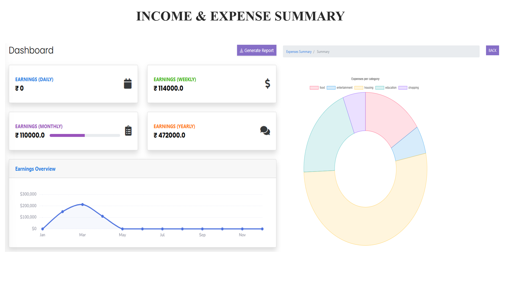
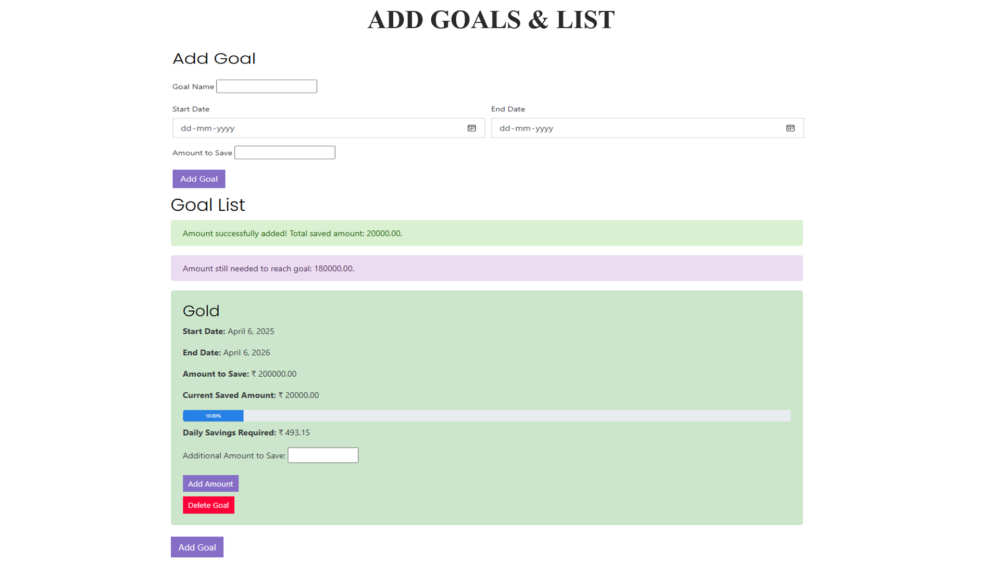
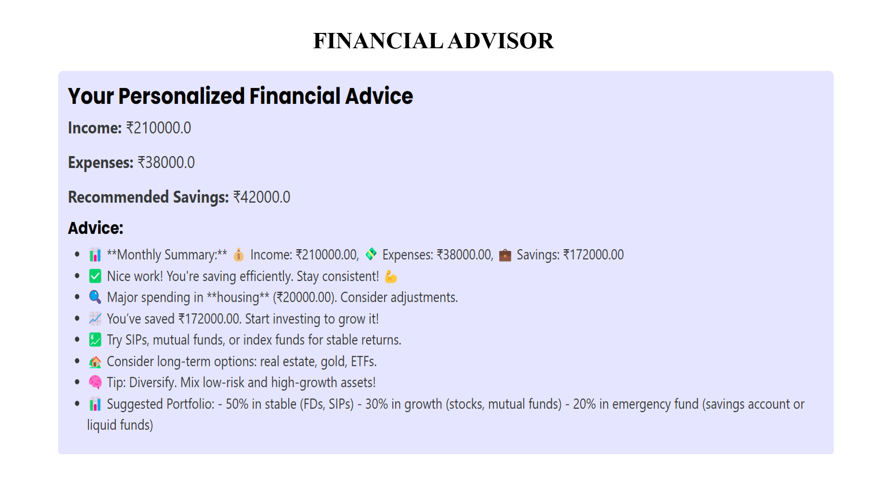
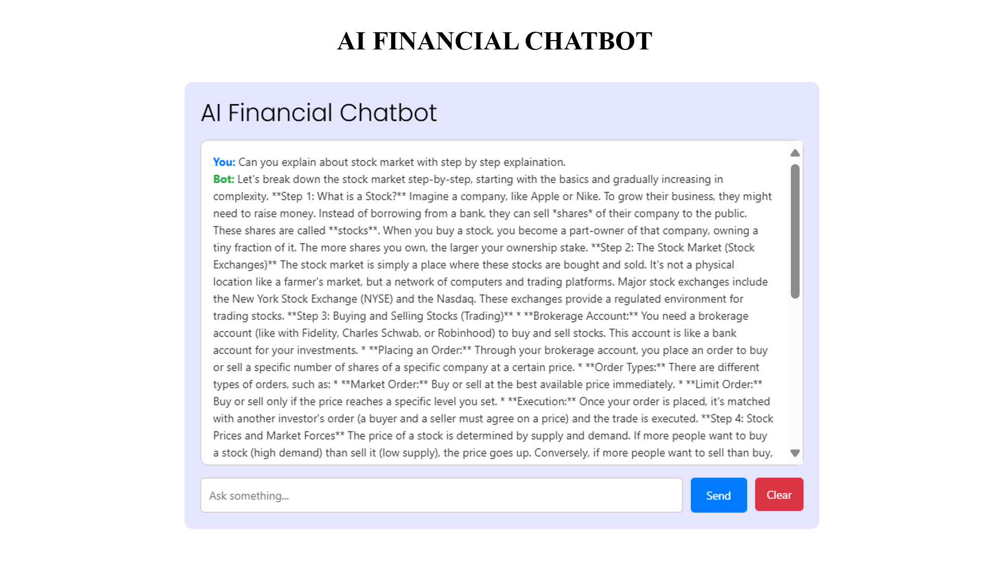

# 💰 AI-Powered Finance Tracker

An intelligent full-stack web application designed to help users track, analyze, and improve their financial health using AI and ML. This app provides real-time analytics, personalized financial insights, and asset management tools including stocks, gold, properties, and loans.

---

## 🚀 Features

- 🔐 **User Authentication** (JWT-based)
- 💸 **Track Income & Expenses**
- 📊 **AI/ML Financial Analysis**
- 💼 **Spending Habit Insights**
- 🧠 **Financial Mistake Detection**
- 🎯 **Monthly Goal Suggestions**
- 📉 **Real-time EMI & Stock Alerts**
- 🪙 **Gold & Property Valuation**
- 🌐 **Currency Selection (INR, USD, etc.)**
- 📈 **Dynamic Dashboard with Charts**
- 💬 **Financial Advice Chatbot**
- 📥 **Downloadable Excel Reports**

---

## 🛠 Tech Stack

**Frontend:**
- Next.js (React)
- Tailwind CSS (with dark theme & neon design)

**Backend:**
- Django + Django REST Framework

**Database:**
- PostgreSQL / SQLite

**AI/ML Modules:**
- Financial Pattern Recognition
- Spending Behavior Analysis
- Predictive Analytics

---

## 📷 Outcome Images

> Add your app screenshots in the placeholders below:

| Dashboard View | Goal Analysis |
|----------------|-------------------|
|  |  |

| Financial Advisor | Chatbot |
|--------------------|------------------|
|  |  |

---

## 🧾 Installation Guide

1. **Clone the Repository**
   ```bash
   git clone https://github.com/yourusername/ai-finance-tracker.git
   cd ai-finance-tracker
